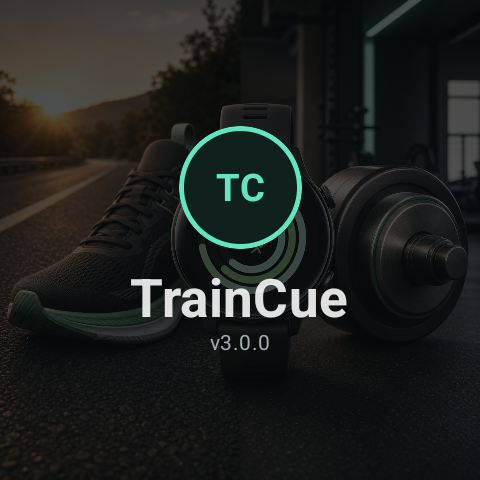
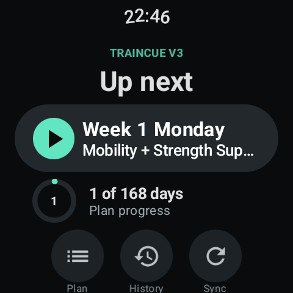
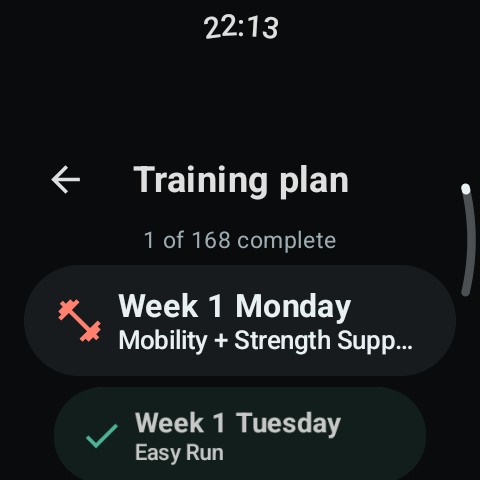
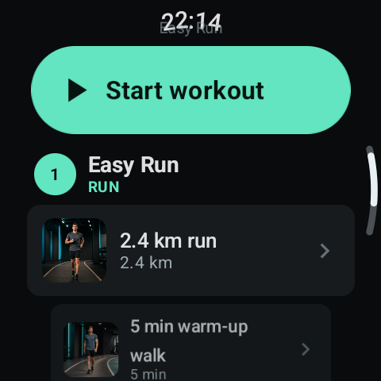
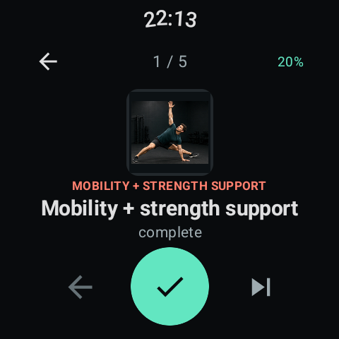

# TrainCue v3

TrainCue is a watch-first Wear OS training companion for running, strength, mobility, recovery, cross-training, and mixed HYROX-style plans. It is designed for a Galaxy Watch-sized screen: open the app, see the next unfinished day, start the session, and work through it one cue at a time.

The app combines the original ideas behind PaceCue and LiftCue in one offline-capable training plan.

## What Changed in v3

- New **Up next** home screen focused on the first unfinished training day
- Compact layout that begins directly below the watch clock
- Guided exercise sessions with current-step and per-set progress
- Active sessions are saved after every action and can be resumed or cancelled
- Outdoor GPS, treadmill timer, and no-tracking run modes
- Spoken kilometre cues, sound, and vibration during outdoor runs
- Complete run instructions remain visible, including warm-up and cool-down cues
- Full 168-day plan browser with completion status
- Session history with duration, completed steps, effort, run mode, and distance
- Hardware Back navigation throughout the app
- Exercise images and dedicated exercise-detail views
- Manual GitHub sync with an offline cached plan
- Existing v2 progress is preserved when upgrading
- Active workouts return to the same exercise after display sleep and wake
- Always-On Display users get a low-power ambient exercise view
- A tappable ongoing-workout indicator returns directly to the saved step

## Visual Walkthrough

These screenshots were captured from TrainCue v3 running on a Galaxy Watch.

### 1. Launch and Home

TrainCue opens with a short launch screen and then goes directly to **Up next**. The Home screen shows the next unfinished workout, overall plan progress, and shortcuts for Plan, History, and Sync. If a workout is interrupted, the same area becomes **In progress** with Resume and Cancel controls.

<p align="center">
  
  
</p>

### 2. Browse the Plan

Open **Plan** to browse all training days. Completed days use a check mark and unfinished days use an icon matching the workout type. Touch scrolling and the hardware Back button work naturally from this view.

<p align="center">
  
</p>

### 3. Review the Workout

Select a day to review every block before starting. Run days show all nested instructions rather than hiding them behind the main run item. For example, Week 1 Thursday includes the run target, warm-up walk, conversational-effort cue, and cool-down walk.

<p align="center">
  
</p>

### 4. Follow the Guided Session

Tap **Start workout** to enter the guided view. The current exercise, image, prescription, session progress, previous, complete, and skip controls fit on one screen. Completing a set advances the set counter; completing the final set advances to the next exercise.

With Always-On Display enabled, TrainCue switches to a low-power ambient layout that keeps the movement, prescription, set number, and session progress visible. With Always-On Display disabled, the panel turns off normally and returns to the same exercise when the watch wakes. If you leave the app during a session, the ongoing-workout indicator on the watch face and launcher returns directly to that exercise.

<p align="center">
  
</p>

### 5. Run Outside or Indoors

When the guided session reaches a run block, TrainCue shows the complete run plan and offers three modes:

- **Outdoor** tracks GPS distance, elapsed time, average pace, and GPS accuracy.
- **Treadmill** runs a timer and logs the planned distance when finished.
- **No tracking** marks the run complete without starting a tracker.

Pressing the hardware Back button returns from the tracker to run setup, then to the guided workout and plan. Outdoor sessions announce kilometre and halfway cues where appropriate.

### 6. Finish and Log

At the end of a session, choose Easy, Good, or Hard. TrainCue records the date, duration, completed steps, effort, run mode, and distance in **History**. Partially completed sessions can also be logged, while completed exercise progress remains saved locally.

## Routine JSON

TrainCue reads its plan from [`routines.json`](routines.json). The root can be either a JSON array or an object containing a `routines` array.

A training day contains one or more blocks:

```json
{
  "id": "week1-thursday",
  "title": "Week 1 Thursday",
  "subtitle": "Run + strength",
  "items": [
    {
      "id": "w1-thursday-run",
      "type": "run",
      "label": "Easy Run",
      "distanceKm": 2.4,
      "workouts": [
        {
          "name": "2.4 km run",
          "sets": 1,
          "reps": "2.4 km",
          "distanceKm": 2.4,
          "imageAsset": "run_walk"
        },
        {
          "name": "5 min warm-up walk",
          "sets": 1,
          "reps": "5 min",
          "imageAsset": "warmup_walk"
        }
      ]
    },
    {
      "id": "w1-thursday-strength",
      "type": "strength",
      "label": "Upper body strength",
      "workouts": [
        {
          "id": "bench-press",
          "name": "Bench Press",
          "sets": 3,
          "reps": "10",
          "imageAsset": "bench_press"
        }
      ]
    }
  ]
}
```

Supported block types currently include `run`, `strength`, `cross-training`, `rest`, `recovery`, `hyrox`, and `mixed`. Unknown types still display and run as general workout blocks.

Run distances may use `distanceKm` or `distanceMiles`. Exercise `imageAsset` values should match a drawable name in `app/src/main/res/drawable` or `drawable-nodpi`.

## GitHub Plan Sync

The watch keeps a local copy of the plan and works offline. Tap **Sync** on Home to download the latest `routines.json` from GitHub. A successful sync replaces the cached plan while preserving completed steps, completed days, history, and any compatible active-session data.

The feed URL is configured as `ROUTINE_FEED_URL` in [`TrainingRepository.kt`](app/src/main/java/com/jongrady/galaxywatchsplits/TrainingRepository.kt).

## Build and Test

Open the repository in Android Studio and run the `app` configuration on a Wear OS emulator or paired Galaxy Watch. The command-line equivalents are:

```powershell
.\gradlew.bat :app:testDebugUnitTest :app:assembleDebug
```

The debug APK is generated at `app/build/outputs/apk/debug/app-debug.apk`.

## Version History

### v3.0.1

Added an ambient guided-workout display, Wear OS ongoing-workout integration, notification-based quick return, and direct routing back to the active exercise.

### v3.0.0

Complete watch-first rewrite with guided sessions, resumable progress, run modes, logging, history, improved navigation, and the 168-day plan browser.

### v2.x

Introduced GitHub routine import, offline plan caching, per-exercise completion, exercise images, GPS run tracking, and treadmill/manual completion.
